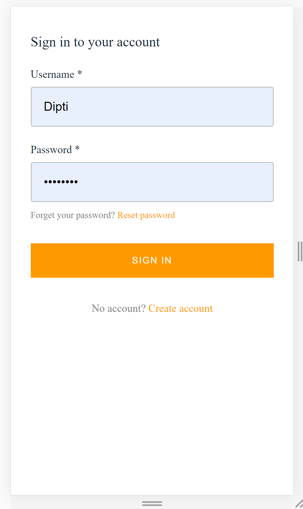
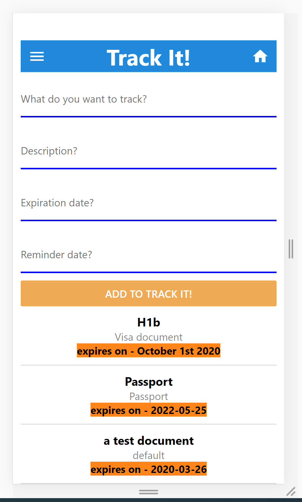
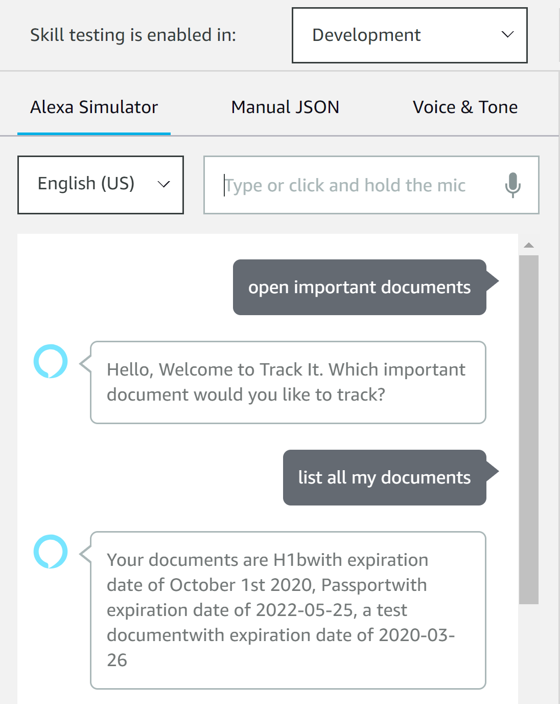
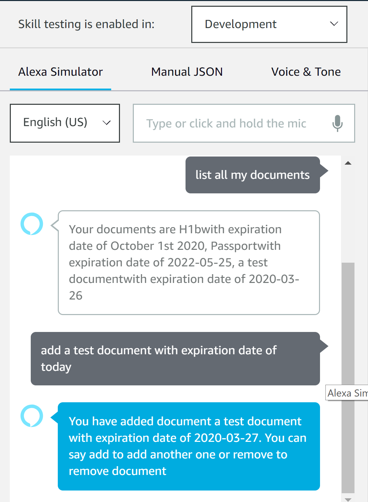

# react-native-alexa-app
A react Native application that shares data with an Alexa skill over dynamoDB.

## React Native App - Login using aws Cognito

## React Native App - Documents List Page 

## Alexa Simulator - Open Skill, List all documents 

## Alexa Simulator - Add a test document 

